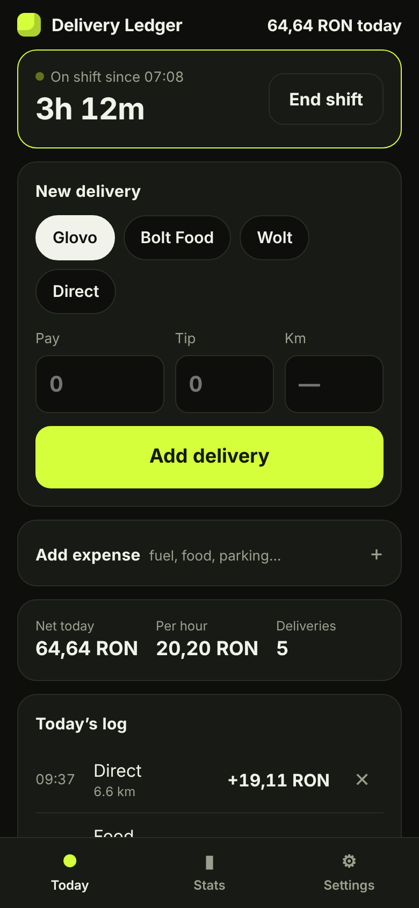
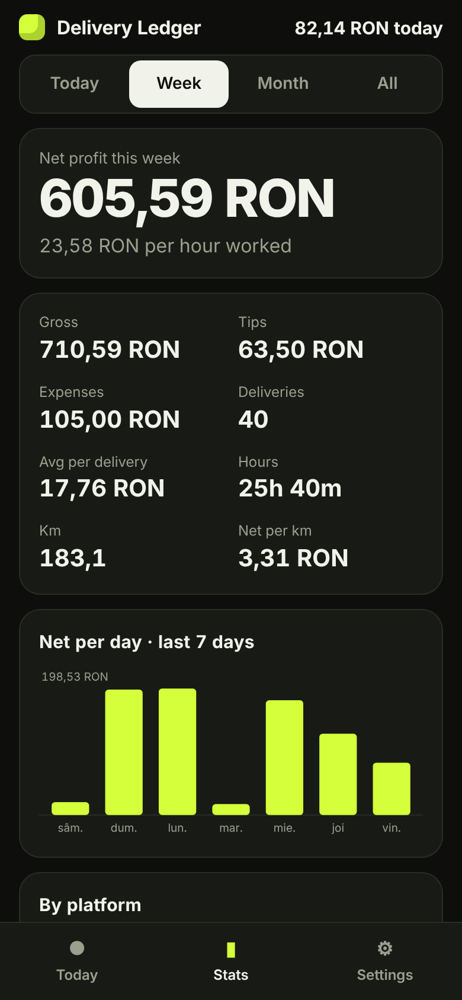
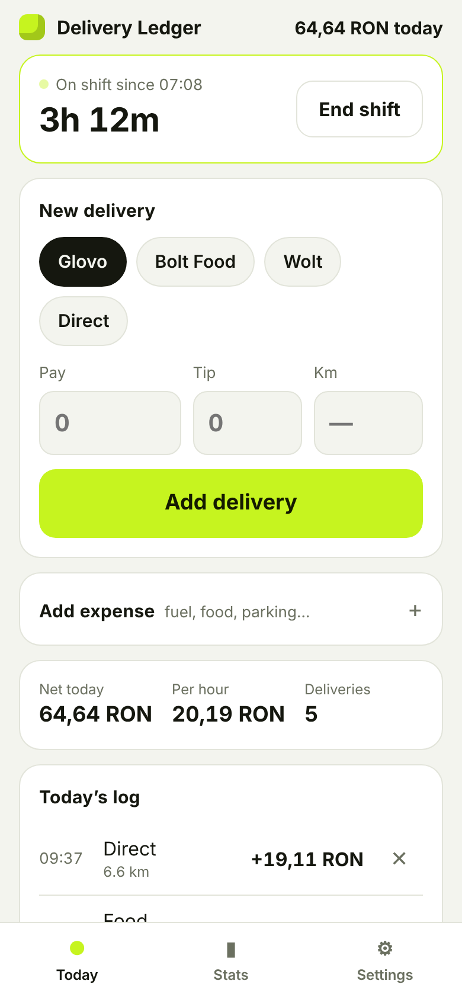

# Delivery Ledger

**What do you actually earn per hour after fuel?** Delivery apps show you gross pay. This shows you the truth.

Delivery Ledger is a tiny, offline-first web app for food-delivery couriers. Log each drop in two taps, track your shift time and expenses, and see your real **net profit per hour, per delivery and per km**, broken down by platform.

I built it for my own delivery business in Iași, Romania, where I drive shifts across Glovo, Bolt Food, Wolt and direct orders.

<p align="center">
  
  
  
</p>

## Features

- **Shift clock**: start and end a shift; hours feed the per-hour numbers, even for shifts past midnight
- **Two-tap logging**: pick the platform, type the pay, done. Tips and km are optional
- **Expenses**: fuel, food, parking, phone, or your own categories
- **Real stats** for today, this week, this month or all time: net profit, net per hour, average per delivery, net per km, tips
- **Per-platform breakdown**: see which app actually pays best for your time
- **Works offline** and installs to your home screen (PWA)
- **Private by design**: no account, no server. Data stays on your phone
- **Export** to CSV for Excel, plus JSON backup and restore
- Any currency (RON by default), light and dark mode

## Try it

**Live:** `https://<your-username>.github.io/delivery-ledger/`

On your phone, open the link and choose **Add to Home Screen**. It then works like a normal app, with or without signal.

## Run locally

No build step and no dependencies. Plain HTML, CSS and JavaScript modules.

```bash
git clone https://github.com/<your-username>/delivery-ledger.git
cd delivery-ledger
npm start      # serves on http://localhost:3000
npm test       # runs the unit tests (Node 20+)
```

## How it works

```
index.html            app shell and three views (Today, Stats, Settings)
src/app.js            UI, storage (localStorage), import and export
src/stats.js          pure calculation functions: totals, per-hour, ranges, CSV
src/style.css         mobile-first styles, light and dark
sw.js                 service worker for offline use
test/stats.test.js    unit tests for the calculations
```

All the money math lives in `src/stats.js` as pure functions, so it is tested separately from the UI. Every push to `main` runs the tests and deploys to GitHub Pages via GitHub Actions.

## Roadmap

- [ ] Romanian translation
- [ ] Auto fuel cost from km and consumption (L/100 km)
- [ ] Best hours heatmap: which time slots pay the most
- [ ] Weekly goal with progress bar
- [ ] Edit past entries

## License

MIT
